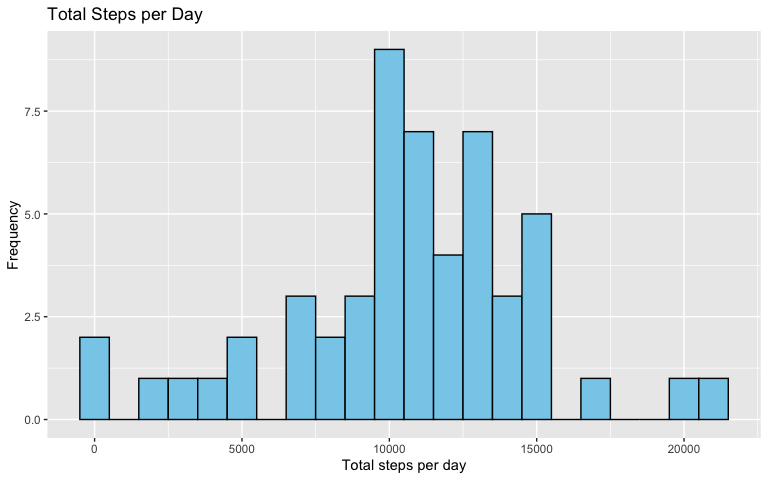
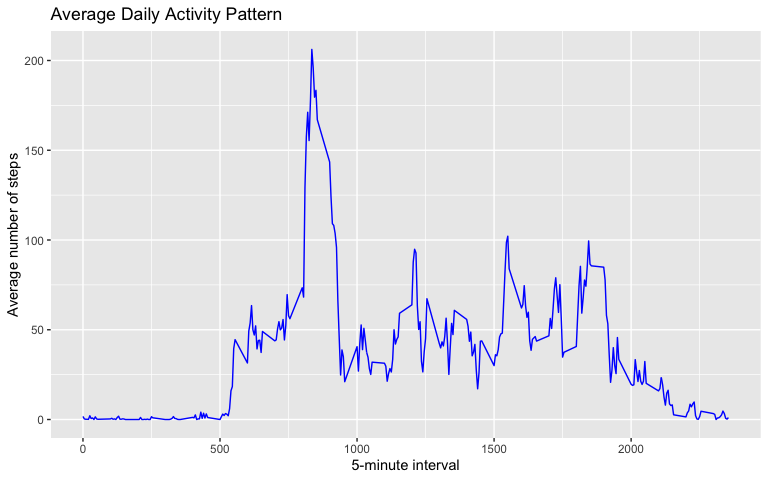
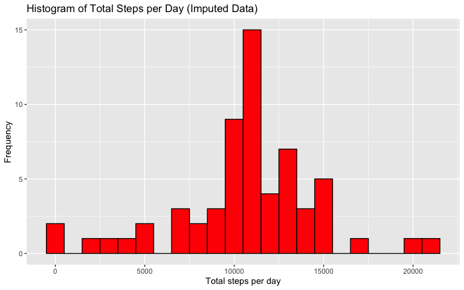
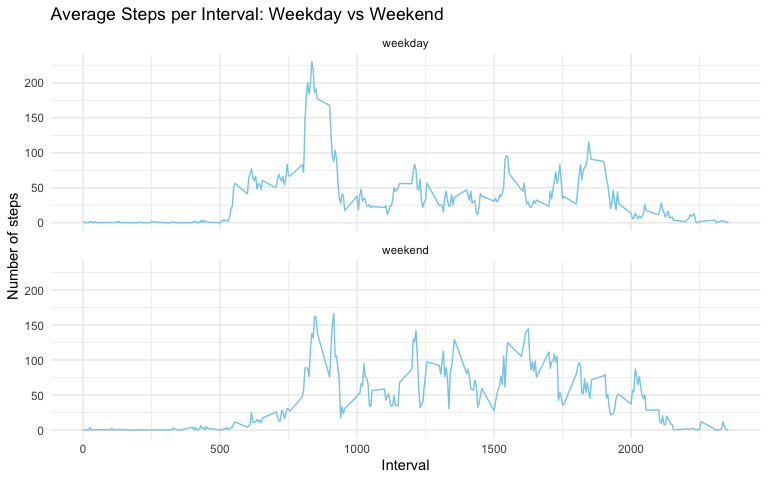

# Reproducible Research: Course Project 1

The goal of this assignment is to perform an analysis of the activity data and present it in a single R Markdown document. 
This assignment uses activity monitoring data collected at 5-minute intervals during October and November 2012, providing step counts from a personal device as part of the quantified self movement.

## Data

The variables included in this dataset are:

steps: Number of steps taking in a 5-minute interval (missing values are coded as NA)
date: The date on which the measurement was taken in YYYY-MM-DD format
interval: Identifier for the 5-minute interval in which measurement was taken

##R Setup and loading libraries 

Loading required libraries and setting global chunk options


```r
library(knitr)
library(dplyr)
library(ggplot2)

knitr::opts_chunk$set(echo = TRUE)
```

## Loading and preprocessing the data

Unzipping and loading data. 
Also transforming date in the right date formal. 

```r
unzip("activity.zip")
data <- read.csv("activity.csv")
str(data)
```

```
## 'data.frame':	17568 obs. of  3 variables:
##  $ steps   : int  NA NA NA NA NA NA NA NA NA NA ...
##  $ date    : chr  "2012-10-01" "2012-10-01" "2012-10-01" "2012-10-01" ...
##  $ interval: int  0 5 10 15 20 25 30 35 40 45 ...
```

```r
data$date <- as.Date(data$date)
```


## What is mean total number of steps taken per day?

Calculating total number of steps taken each day ignoring the missing values in the data.


```r
steps_per_day <- aggregate(steps ~ date, data, sum, na.rm = TRUE)
head(steps_per_day)
```

```
##         date steps
## 1 2012-10-02   126
## 2 2012-10-03 11352
## 3 2012-10-04 12116
## 4 2012-10-05 13294
## 5 2012-10-06 15420
## 6 2012-10-07 11015
```

Making a histogram of the total number of steps taken each day


```r
ggplot(steps_per_day, aes(x = steps)) +
  geom_histogram(binwidth = 1000, fill = "skyblue", color = "black") +
  labs(title = "Total Steps per Day",
       x = "Total steps per day",
       y = "Frequency")
```

<!-- -->

Calculating the mean and median total number of steps taken per day


```r
mean_steps <- mean(steps_per_day$steps)
median_steps <- median((steps_per_day$steps))

print(paste("The mean total number of steps taken per day:", mean_steps))
```

```
## [1] "The mean total number of steps taken per day: 10766.1886792453"
```

```r
print(paste("The median total number of steps taken per day:", median_steps))
```

```
## [1] "The median total number of steps taken per day: 10765"
```

## What is the average daily activity pattern?

## What is the average daily activity pattern?

Calculating the average number of steps taken in each 5-minute interval, averaged across all days.


```r
interval_av <- aggregate(steps~interval, data, mean)
head(interval_av)
```

```
##   interval     steps
## 1        0 1.7169811
## 2        5 0.3396226
## 3       10 0.1320755
## 4       15 0.1509434
## 5       20 0.0754717
## 6       25 2.0943396
```

Making a time series plot  of the 5-minute interval (x-axis) and the average number of steps taken, averaged across all days (y-axis)


```r
ggplot(interval_av, aes(x = interval, y = steps)) +
  geom_line(color = "blue") +
  labs(title = "Average Daily Activity Pattern",
       x = "5-minute interval",
       y = "Average number of steps")
```

<!-- -->

Finding the 5-minute interval that, on average across all days, contains the maximum number of steps.


```r
x <-  which.max(interval_av$steps)
max_int <- interval_av[x, ]

print(paste("5-minute interval that, on average across all days, contains the maximum number of steps:",(max_int[,1])))
```

```
## [1] "5-minute interval that, on average across all days, contains the maximum number of steps: 835"
```

## Imputing missing values

## Imputing missing values

Calculating missing values in data


```r
mis_val <- sum(is.na(data))
print(paste("Number of missing values in data:", mis_val))
```

```
## [1] "Number of missing values in data: 2304"
```

Filling missing values in the new dataset using mean for each 5-minute interval


```r
interval_av2 <- aggregate(steps ~ interval, data, function(x) mean(x, na.rm = TRUE))

data_imputed <- data

for(i in 1:nrow(data_imputed)) {
  if(is.na(data_imputed$steps[i])) {
    data_imputed$steps[i] <- interval_av2$steps[interval_av2$interval == data_imputed$interval[i]]
  }
}

sum(is.na(data_imputed))  
```

```
## [1] 0
```

Making a histogram of the total number of steps taken each day on imputed data 


```r
total_steps_2 <- aggregate(steps ~ date, data_imputed, sum)

ggplot(total_steps_2, aes(x = steps)) +
  geom_histogram(binwidth = 1000, fill = "red", color = "black") +
  labs(title = "Histogram of Total Steps per Day (Imputed Data)",
       x = "Total steps per day",
       y = "Frequency")
```

<!-- -->
Calculating the mean and median of total number of steps taken per day.


```r
mean_steps2 <- mean(total_steps_2$steps)
median_steps2 <- median((total_steps_2$steps))

print(paste("The mean total number of steps taken per day:", mean_steps2))
```

```
## [1] "The mean total number of steps taken per day: 10766.1886792453"
```

```r
print(paste("The median total number of steps taken per day:", median_steps2))
```

```
## [1] "The median total number of steps taken per day: 10766.1886792453"
```

Estimates differ slightly: the median increased after filling missing values, while the mean remained almost unchanged. The peak of the distribution shifted slightly to the right, as days that previously had missing values now show more steps. 

## Are there differences in activity patterns between weekdays and weekends?

Creating a new factor variable indicating whether a given date is a weekday or weekend day


```r
data_imputed$day_of_week <- weekdays(as.Date(data_imputed$date))
data_imputed$weekday <- ifelse(data_imputed$day_of_week %in% c("Saturday", "Sunday"), 
                               "weekend", 
                               "weekday")

data_imputed$weekday <- factor(data_imputed$weekday, levels = c("weekday", "weekend"))
```

Plotting a time series plot  of the 5-minute interval  and the average number of steps taken, averaged across all weekday days or weekend days.


```r
data_imputed$weekday <- factor(data_imputed$weekday, levels = c("weekday", "weekend"))

avg_steps <- aggregate(steps ~ interval + weekday, data_imputed, mean)

print( 
ggplot(avg_steps, aes(x = interval, y = steps)) +
  geom_line(color = "skyblue") +
  facet_wrap(~weekday, ncol = 1) +
  labs(title = "Average Steps per Interval: Weekday vs Weekend",
       x = "Interval",
       y = "Number of steps") +
  theme_minimal()
)
```

<!-- -->
